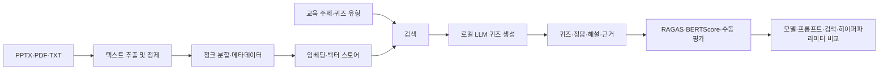

# 신입사원 업무교육 퀴즈 생성 RAG

사내 교육자료를 검색하여 **근거가 있는 신입사원용 퀴즈**를 생성하고, RAG 적용 전후 및 여러 검색·생성 설정의 성능을 비교하는 3인 팀 프로젝트입니다.

기존 RAG 실습의 `질문 → 답변 → 점수` 흐름을 다음과 같이 바꿉니다.

```text
교육 주제 입력 → 관련 교육자료 검색 → 퀴즈·정답·해설·근거 생성 → 품질 평가
```

## 1. 프로젝트 목표

- RAG가 없는 LLM이 그럴듯하지만 근거가 없거나 정답이 틀린 퀴즈를 만들 수 있음을 확인합니다.
- 회사의 실제 교육자료에 근거한 객관식·OX·서술형 퀴즈를 생성합니다.
- 생성 결과에 정답, 해설, 출처, 근거 문장을 함께 제시합니다.
- Hugging Face 로컬 생성 모델, 프롬프트, 임베딩 모델, 벡터 스토어, 검색 방식과 하이퍼파라미터에 따른 품질 차이를 비교합니다.
- 최종적으로 신입사원 교육에 사용할 수 있는 재현 가능한 RAG 파이프라인과 실험 결과를 제시합니다.

> 이 프로젝트는 산업안전에만 한정하지 않습니다. 안전교육은 오류의 위험성을 설명하기 좋은 첫 검증 주제이며, 최종 범위는 전사 업무교육입니다.

## 2. 데이터 범위

### 2.1 주 데이터

`경북대 교육 발표자료 250416-1.pptx`를 PDF와 텍스트 추출 가능 형식으로 변환하여 사용합니다.

확인된 원본은 총 165개 슬라이드이며 다음과 같은 내용을 포함합니다.

- 회사·계열사·제품·고객사 소개
- 자동차 차체 구조 및 명칭
- 원자재, 프레스, 금형, 조립, 용접 공정
- 생산·품질관리와 불량 사례
- 부서별 직무, 업무 절차, 경력개발 체계
- 비전검사, 스마트팩토리, 설비·물류·안전관리 시스템
- 미래 모빌리티
- ESG 및 환경·사회·지배구조 관계법령

## 3. 전체 워크플로우


#### 수동 평가

자동 평가의 오류를 줄이기 위해 실험별 표본을 5점 척도로 검토합니다.

| 항목 | 질문 |
| --- | --- |
| 정확성 | 정답과 해설이 원문과 일치하는가? |
| 근거성 | 제시한 근거만으로 답을 판단할 수 있는가? |
| 명확성 | 신입사원이 오해 없이 이해할 수 있는가? |
| 난이도 | 요청한 쉬움/보통/어려움 수준과 맞는가? |
| 교육 유용성 | 실제 업무교육에서 다룰 가치가 있는가? |

## 4. 3인 역할 분담

세 사람 모두 공통 평가셋과 코드 리뷰에는 참여하되, 최종 책임자는 아래와 같이 정합니다.

### 팀원 A: 데이터·지식베이스·검색 담당

### 팀원 B: 로컬 LLM·프롬프트·퀴즈 생성 담당

### 팀원 C: 평가·실험관리·결과 시각화 담당

### 공동 책임

- 팀원 A와 B가 각자 만든 결과 중 10개씩 교차 검수합니다.
- 팀원 C가 평가 기준을 혼자 확정하지 않고 세 명이 5개 샘플을 먼저 공동 채점해 기준을 맞춥니다.
- 모델 비교 시 프롬프트와 검색 결과를 동일하게 고정합니다.
- 검색 비교 시 생성 모델과 프롬프트를 동일하게 고정합니다.
- 모든 결과에 설정 파일, 모델명, seed, 실행 시간을 저장합니다.

## 5. BGE-M3로 최종 청킹 방법 선별

`src/select_chunking_bge_m3.py`는 임베딩·검색 조건을 아래 값으로 고정하고
청킹 방법만 바꿔 비교합니다.

| 항목 | 고정값 |
| --- | --- |
| 임베딩 모델 | `BAAI/bge-m3` |
| 임베딩 정규화 | 사용 |
| Query/Passage 접두사 | 미사용 |
| 거리 방식 | `l2` |
| 검색 방식 | 슬라이드 중복 제거 검색 |
| Top-K | 5 |
| Fetch-K | 15 |
| 평가셋 | `eval_questions_100.json` 100문항 |

비교하는 청킹 방법은 `recursive`, `sentence_pack`, `slide_aware`,
`title_body` 네 가지입니다. MRR을 우선 기준으로 사용하고 동률이면
Recall@5, Precision@5, 적은 청크 수 순으로 최종 방법을 정합니다.

프로젝트 루트에서 실행합니다.

```powershell
python src\select_chunking_bge_m3.py
```

PPT 경로를 직접 지정할 수도 있습니다.

```powershell
python src\select_chunking_bge_m3.py `
  --pptx "C:\데이터\경북대 교육 발표자료 250416-1.pptx"
```

실행 중 터미널에 순위표와 최종 선별 방법이 출력됩니다. 결과 시각화는
이미지가 아니라 다음 두 파일로 저장됩니다.

```text
result/chunking_selection_bge_m3.csv
result/chunking_selection_bge_m3.html
```

CSV는 Excel에서 점수를 비교할 때 사용하고, HTML은 브라우저에서 표와
MRR 막대를 확인할 때 사용합니다. CSV·HTML을 먼저 저장한 뒤 평가용
Chroma 인덱스 삭제를 시도합니다. Windows 파일 잠금으로 삭제되지 않아도
결과 파일에는 영향이 없으며, Python 종료 후 해당 폴더를 직접 삭제할 수
있습니다. 인덱스를 유지하려면 `--keep-index`를 지정합니다.
